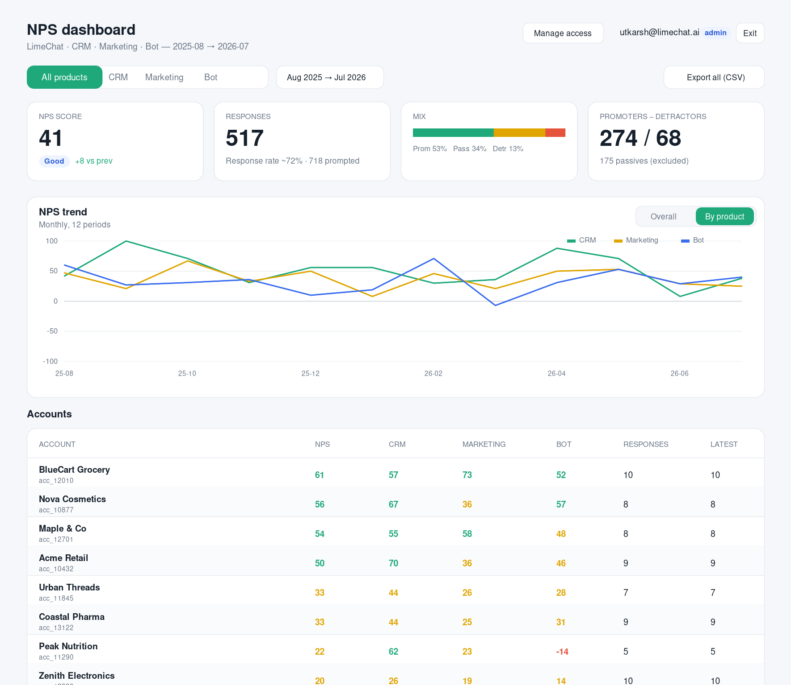

# LimeChat NPS

A drop-in Net Promoter Score® system for LimeChat's three products — **CRM**, **Marketing**, and **Bot**.



It ships as three coordinated pieces:

| Package | What it is | Tech |
| --- | --- | --- |
| `packages/widget` | An injectable, dependency-free JS snippet that shows the NPS pop-up in-app and submits scores. | TypeScript → single IIFE bundle |
| `packages/server` | Multi-tenant API: eligibility (once-a-month throttle), response ingest, dashboard analytics, CSV export. | Node + TypeScript + Fastify + PostgreSQL |
| `packages/dashboard` | Ops dashboard: NPS by product, trend over months/years, per-user table, per-account report download. | React + TypeScript + Vite + Recharts |

## Why it's built this way

The design mirrors how best-in-class in-app survey tools (Delighted, Retently, SatisMeter, Pendo, ChurnZero) work:

1. **The client is dumb, the server is the source of truth.** The widget never decides *on its own* whether a user is "due." It asks the server (`GET /v1/nps/eligibility`). This makes the "once a month per user per product" rule reliable across devices, browsers, and sessions — you cannot game it by clearing localStorage.
2. **One tiny snippet, three products.** The same script is embedded in CRM, Marketing, and Bot. The only difference is one config value: `product`. All segmentation, filtering and trend analysis keys off that.
3. **Account + user identity is passed in, never guessed.** LimeChat already knows the logged-in user and their `account_id` (the unique identifier of the account on the platform). The host app passes those to the widget, so every score is attributable to a real account and email.
4. **NPS is computed server-side, consistently.** Promoters (9–10), Passives (7–8), Detractors (0–6), `NPS = %promoters − %detractors`. One implementation, used by the API and the dashboard, so numbers never disagree.

## NPS definition (as implemented)

- Question: *"How likely are you to recommend us to a friend or colleague?"* (0–10) plus a free-text reason.
- **Promoters** = 9–10, **Passives** = 7–8, **Detractors** = 0–6.
- **NPS = %Promoters − %Detractors**, range −100…+100. Passives count toward the denominator only.

## Quick start (local)

```bash
# 1. Boot Postgres
docker compose up -d db

# 2. Install & migrate
pnpm install
pnpm --filter @limechat-nps/server migrate

# 3. Run the API (:4000) and dashboard (:5173)
pnpm --filter @limechat-nps/server dev
pnpm --filter @limechat-nps/dashboard dev

# 4. Build the injectable widget bundle
pnpm --filter @limechat-nps/widget build   # → packages/widget/dist/limechat-nps.js
```

## Embedding the widget

```html
<script src="https://cdn.limechat.ai/nps/limechat-nps.js" async></script>
<script>
  window.LimeChatNPS = window.LimeChatNPS || [];
  LimeChatNPS.push(['init', {
    writeKey: 'pk_live_xxx',        // public write key, safe to expose
    product:  'crm',                // 'crm' | 'marketing' | 'bot'
    account:  { id: 'acc_10432', name: 'Acme Retail' },
    user:     { email: 'ravi@acme.com', id: 'usr_88' }
  }]);
</script>
```

That's the entire integration. The widget handles eligibility, the pop-up, the once-a-month cadence, and submission.

## Docs

- [`docs/ARCHITECTURE.md`](docs/ARCHITECTURE.md) — system design, data flow, throttle logic, scaling notes.
- [`docs/API.md`](docs/API.md) — full endpoint contracts.
- [`docs/INTEGRATION.md`](docs/INTEGRATION.md) — how to embed in CRM, Marketing, and Bot.

## Layout

```
limechat-nps/
├── docker-compose.yml
├── package.json                # pnpm workspace root
├── docs/
├── db/migrations/              # versioned SQL
└── packages/
    ├── server/                 # Fastify API
    ├── widget/                 # injectable SDK
    └── dashboard/              # React ops UI
```
