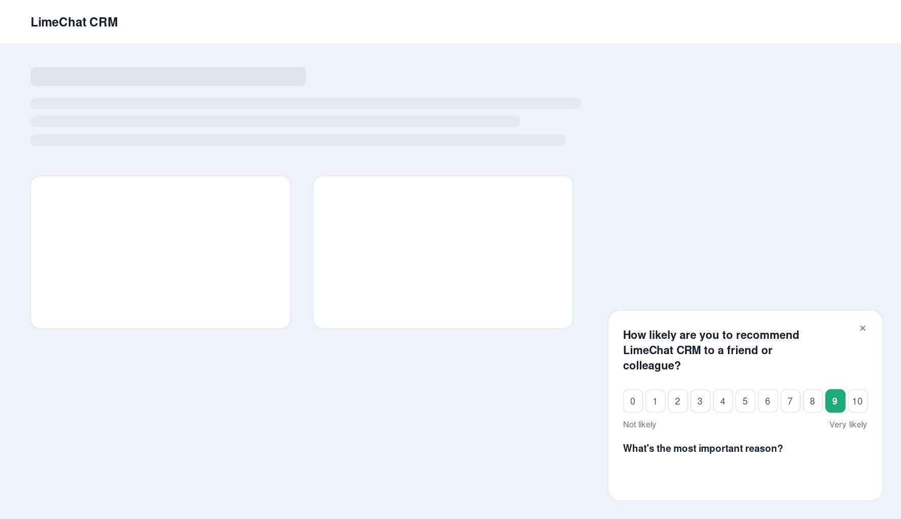
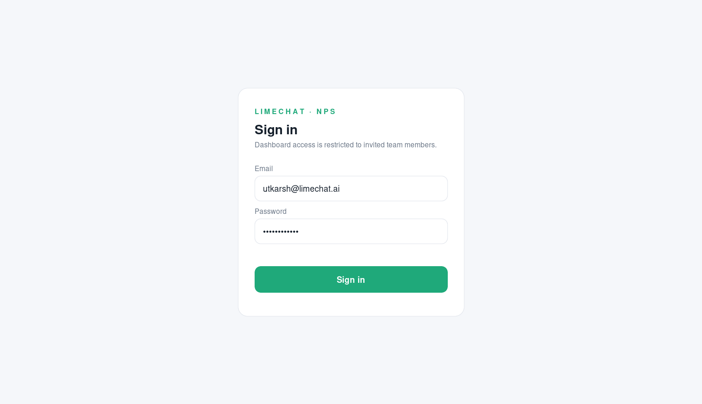

# LimeChat NPS — Complete Guide

This is our in-house Net Promoter Score® system. It lets us collect NPS from users across all three of our products — **CRM**, **Marketing**, and **Bot** — and see the results in one dashboard.

I've put this guide together so the tech team has everything needed to integrate it: what it does, how it's built, how we drop it into each product, and how we control who can access the analytics.

- [1. Overview](#1-overview)
- [2. Screenshots](#2-screenshots)
- [3. Architecture](#3-architecture)
- [4. Features](#4-features)
- [5. How we embed the widget in our products](#5-how-we-embed-the-widget-in-our-products)
- [6. Dashboard access & login management](#6-dashboard-access--login-management)
- [7. End-to-end setup](#7-end-to-end-setup)
- [8. Operations & scaling](#8-operations--scaling)
- [9. Extending it](#9-extending-it)

---

## 1. Overview

The system has three parts that work together:

| Part | What it is | Where it runs |
| --- | --- | --- |
| **Widget** | A tiny, dependency-free JavaScript snippet that shows the NPS pop-up inside our products and submits scores. | In each product's browser front-end |
| **API server** | A Node + TypeScript (Fastify) service that decides eligibility, stores responses, computes analytics, exports CSV, and authenticates dashboard users. | Our backend, next to a PostgreSQL database |
| **Dashboard** | A React app where our team logs in to see NPS by product, trend over time, per-account detail, and download reports. | A protected internal URL |

**The NPS definition we implement** — the standard one:

- Question: *"How likely are you to recommend us to a friend or colleague?"* scored **0–10**, plus a free-text reason.
- **Promoters** = 9–10 · **Passives** = 7–8 · **Detractors** = 0–6.
- **NPS = %Promoters − %Detractors**, on a scale of −100 to +100. Passives count toward the total but not the score.
- Rating bands: below 0 needs attention · 0–49 good · 50–69 excellent · 70+ world-class.

**The cadence** — we survey each user **at most once per calendar month, per product**. A user can therefore give us up to three scores a month (one for CRM, one for Marketing, one for Bot), but never two for the same product in the same month.

---

## 2. Screenshots

**The NPS pop-up, embedded in a product** — a two-step in-app card (0–10 scale, then a reason). It renders in a Shadow DOM so our product styles and the widget can never interfere with each other.



**The analytics dashboard** — NPS score with rating and delta, response mix, a product filter, the monthly trend (overall or split by product), and the per-account table. Everything below is rendered from ~30 months of seeded demo data.


**The login screen** — dashboard access is gated; only invited team members can sign in.



---

## 3. Architecture

```
   ┌──────────────────────────────────────────────────────────────┐
   │  Our apps: CRM · Marketing · Bot  (each embeds ONE snippet)    │
   │     LimeChatNPS.push(['init', { product, account, user }])     │
   └───────────────┬───────────────────────────────┬───────────────┘
                   │ GET  /v1/nps/eligibility       │  write key (public)
                   │ POST /v1/nps/responses         │
                   ▼                                ▼
        ┌──────────────────────────────────────────────────┐
        │              Fastify API server                    │
        │  auth:  write-key (widget) · JWT session (dashboard)│
        │  eligibility → monthly throttle (server-authoritative)│
        │  ingest      → store score + reason + category      │
        │  analytics   → NPS math, trend, per-account         │
        │  export      → CSV per account / all                │
        │  auth        → login, roles, user management         │
        └───────────────┬──────────────────────────────────┘
                        │ SQL
                        ▼
             ┌────────────────────────┐
             │       PostgreSQL        │
             │ accounts · users ·      │
             │ survey_prompts ·        │
             │ nps_responses ·         │
             │ dashboard_users         │
             └────────────────────────┘
                        ▲  GET /v1/nps/analytics/*  (Bearer JWT)
        ┌───────────────┴──────────────────────────────────┐
        │         React dashboard (login required)          │
        │  cards · product filter · trend · table · export  │
        │  admin-only: manage dashboard users & roles       │
        └───────────────────────────────────────────────────┘
```

### Why it's shaped this way

**The client is dumb; the server is the source of truth.** The widget never decides on its own whether a user is "due" this month — it asks `GET /v1/nps/eligibility`. This is what makes "once a month per user per product" reliable: the rule holds across devices, browsers and cleared caches, and it can't be gamed from the front-end. This mirrors how tools like Delighted, Retently, SatisMeter and Pendo run in-app surveys.

**Identity is passed in, never guessed.** We already know the logged-in user and their `account_id` (our platform-unique account identifier). The host app hands those to the widget, so every score is attributable to a real account and email.

**NPS math lives in one place** (`packages/server/src/domain/nps.ts`), used by both the API and the exports, so the dashboard and a downloaded CSV can never disagree.

### Data model

Five tables (`db/migrations`):

- **accounts** — one row per LimeChat account. `account_ref` is the id we pass in; a cached `name` is stored for display.
- **users** — one row per (account, email); this is who we survey.
- **survey_prompts** — the throttle ledger: one row each time a user is *asked*, unique on `(user, product, month)`. It powers the once-a-month rule and the response-rate metric, and it stops a dismissed pop-up from re-nagging the same month.
- **nps_responses** — the score (0–10) + reason + derived category, unique on `(user, product, month)` so a score is idempotent even under concurrent submits.
- **dashboard_users** — our operators who can log in to the dashboard: email, scrypt password hash, role (`admin`/`viewer`), active flag.

`period_month` (a DATE pinned to the 1st, in the account's timezone) is the unit of the monthly cadence and the x-axis of every trend. Because eligibility keys off it, the survey window resets automatically on the 1st — **no cron is needed** for the core cadence.

### The monthly throttle, precisely

1. Widget loads → `GET /v1/nps/eligibility?product=crm&accountRef=…&email=…`.
2. Server upserts the account + user, computes the current `period_month`, and checks the ledger.
3. If the user hasn't been prompted for that product this month, the server **opens the prompt row inside the same transaction** and returns `{ eligible: true, promptId }`. Doing it at decision time closes the multi-tab race — the unique constraint lets exactly one request win.
4. Widget shows the pop-up → on submit, `POST /v1/nps/responses` with the `promptId`; on close, an optional `dismiss` call.

---

## 4. Features

**Collection**

- One injectable snippet for all three products; the only difference is `product: 'crm' | 'marketing' | 'bot'`.
- Clean two-step pop-up: 0–10 colour-coded scale (red detractors → amber passives → green promoters), then a "most important reason" text box, then a thank-you.
- Rendered in a **Shadow DOM**, so our product CSS can't break it and its styles can't leak out.
- Once-a-month-per-product throttle, enforced server-side.
- Auto-show after a short delay, **or** behavioural triggers we fire ourselves (after onboarding, after a closed ticket, before/after renewal) via `show()` — still throttled.
- Fails safe: if the API is unreachable, the widget silently does nothing rather than blocking the app.

**Analytics dashboard**

- Headline **NPS** with rating band and delta vs. the previous period.
- **Response count** and **response rate** (responses ÷ prompts).
- Promoter / passive / detractor **mix bar**.
- **Product filter**: All · CRM · Marketing · Bot — every number and chart updates.
- **Trend chart** over months and years, toggleable between one overall line and three per-product lines.
- **Accounts table** with per-product NPS columns, sortable by NPS / responses / recency.
- **Account drill-in**: every response for that account with account id, email, product, month, score and reason.
- **Downloadable reports**: per-account CSV and a bulk all-accounts CSV (CSV-injection-safe).

**Access control**

- Email + password login; sessions are signed JWTs.
- Two roles: **admin** (can manage users) and **viewer** (read-only analytics).
- Admin UI to invite users, set roles, enable/disable accounts, and reset passwords.
- Every analytics and export endpoint requires a valid session; a server-side service key remains available for BI jobs.

---

## 5. How we embed the widget in our products

This is the whole integration. The same two script tags go into **CRM, Marketing, and Bot** — only the `product` value differs.

### Step 1 — Serve the bundle

We build it once and host `packages/widget/dist/limechat-nps.js` on our CDN (e.g. `https://cdn.limechat.ai/nps/limechat-nps.js`). It's ~6 KB and has no dependencies.

```bash
pnpm --filter @limechat-nps/widget build
```

### Step 2 — Load the script in the app shell

```html
<script src="https://cdn.limechat.ai/nps/limechat-nps.js" async></script>
```

It installs a command queue (`window.LimeChatNPS`), so `init` calls made before the script finishes loading are buffered — the same pattern analytics SDKs use.

### Step 3 — Initialise once we know the user

Call this after auth resolves. Pass our platform-unique `account.id` and the user's `email`.

**CRM**
```js
window.LimeChatNPS = window.LimeChatNPS || [];
LimeChatNPS.push(['init', {
  writeKey: 'pk_live_xxx',
  product:  'crm',
  account:  { id: currentAccount.id, name: currentAccount.name },
  user:     { email: currentUser.email, id: currentUser.id }
}]);
```

**Marketing** — identical, with `product: 'marketing'`.
**Bot** — identical, with `product: 'bot'`.

On `init`, the widget checks eligibility and, if the user is due this month for that product, shows the pop-up automatically. **Nothing else to call.**

### Step 4 (optional) — Trigger on a behavioural moment instead

Best practice is to survey after a meaningful interaction. Set `auto: false` and call `show()` from the moment we care about — the monthly throttle still applies:

```js
LimeChatNPS.push(['init', { /* …config…, */ auto: false }]);
// e.g. right after onboarding completes, or a support ticket is closed:
LimeChatNPS.push(['show']);
```

### Configuration reference

| Key | Type | Default | Notes |
| --- | --- | --- | --- |
| `writeKey` | string | — | public write key (safe in the browser) |
| `product` | `'crm'\|'marketing'\|'bot'` | — | required |
| `account.id` | string | — | platform-unique account id, required |
| `account.name` | string | — | display only |
| `user.email` | string | — | required |
| `user.id` | string | — | host user id, optional |
| `auto` | boolean | `true` | auto check + show on init |
| `showDelayMs` | number | `4000` | delay before auto-show |
| `apiBase` | string | `https://nps.limechat.ai` | override for staging |
| `position` | `'bottom-right'\|'bottom-left'\|'center'` | `'bottom-right'` | placement |
| `accentColor` | string | `#1fa97a` | brand accent |
| `onSubmit(payload)` | function | — | fires after a score is sent |
| `onDismiss()` | function | — | fires when closed without a score |

### Verifying the integration

Point `apiBase` at staging and use a `pk_test_…` key. Call eligibility twice for the same user + product in one month — the second returns `eligible: false`. That confirms the throttle is wired correctly. `packages/widget/example.html` is a ready-made test harness.

---

## 6. Dashboard access & login management

The dashboard is **not public**. Every visit requires signing in, and every analytics/export API call must carry a valid session token.

### How it works

- **Login** — `POST /v1/auth/login` with email + password returns a signed **JWT** (HS256, 12-hour expiry). The dashboard stores it and sends it as `Authorization: Bearer <token>` on every request.
- **Passwords** are hashed with **scrypt** (per-user random salt, constant-time comparison) — never stored in plain text.
- **Roles**:
  - **admin** — full analytics **plus** user management.
  - **viewer** — full analytics, read-only. Cannot see or change the user list.
- **Session middleware** protects `/v1/nps/analytics/*` and `/v1/nps/export/*`. It accepts either a dashboard JWT *or* the server-side `ADMIN_API_KEY` (for BI/service jobs), so automated exports keep working without a human login.

### Creating the first admin

Right after migrating, bootstrap one admin from the CLI:

```bash
pnpm --filter @limechat-nps/server create-admin -- \
  --email you@limechat.ai --name "Your Name" --password "a-long-password"
```

(It's a no-op if that email already exists.)

### Managing the team from the UI

Sign in as an admin and click **Manage access** (top right):

- **Invite a team member** — enter email, name, a temporary password, and a role. They can sign in immediately; have them reset their password after first login.
- **Change role** — flip anyone between viewer and admin inline.
- **Disable / enable** — disabled users are refused at login even if their password is correct (useful for offboarding without deleting history).
- **Reset password** — set a new password for a user who's locked out.

### Security notes

- Set a strong, random `JWT_SECRET` in production. Rotating it invalidates all existing sessions (everyone must log back in).
- Serve the dashboard and API over HTTPS only; the JWT is a bearer token.
- The `ADMIN_API_KEY` is a service credential — keep it server-side, never ship it in the browser bundle.
- Login requests are covered by the API's per-IP rate limit, which blunts brute-force attempts.
- **SSO-ready**: because login is isolated behind `/v1/auth/*` and the session middleware, we can later swap email/password for Google/Okta via OIDC without touching the analytics code. See §9.

---

## 7. End-to-end setup

```bash
# 1. Start PostgreSQL
docker compose up -d db

# 2. Install dependencies
pnpm install

# 3. Configure the server
cp packages/server/.env.example packages/server/.env
#   → set DATABASE_URL, a strong JWT_SECRET, ADMIN_API_KEY, WRITE_KEYS

# 4. Create tables (runs 001_init + 002_dashboard_auth)
pnpm --filter @limechat-nps/server migrate

# 5. (optional) Load ~30 months of demo NPS data
pnpm --filter @limechat-nps/server seed

# 6. Create the first dashboard admin
pnpm --filter @limechat-nps/server create-admin -- \
  --email you@limechat.ai --password "a-long-password"

# 7. Run the API (:4000) and dashboard (:5173)
pnpm --filter @limechat-nps/server dev
pnpm --filter @limechat-nps/dashboard dev

# 8. Build the widget bundle for our CDN
pnpm --filter @limechat-nps/widget build
```

Open `http://localhost:5173`, sign in with the admin we created, and we're looking at live analytics. Embed the snippet (section 5) in each product and real scores start flowing in.

---

## 8. Operations & scaling

- **Reads dominate.** The summary and trend change at most once per submitted score, so a short cache (30–60s) and read replicas absorb dashboard traffic comfortably.
- **The write path** is a single upsert + insert guarded by a unique constraint — safe behind an autoscaling API tier, idempotent by construction.
- **`nps_responses`** partitions naturally by `period_month` once volume is high.
- **The widget** is a static, immutable-hashed asset — serve it from a CDN.
- **No core cron.** The monthly window resets on the 1st automatically. We'd add a scheduled job only if we later want to *proactively* email users who never log in.

---

## 9. Extending it

- **SSO / OIDC** — add a `/v1/auth/oidc/callback` route that verifies the provider's token and issues the same session JWT; the rest of the app is unchanged.
- **Behavioural triggers** — wire `show()` into specific product moments (post-onboarding, post-ticket, renewal) for cleaner, event-based sampling.
- **Alerting** — a detractor (0–6) webhook to Slack so CS can follow up within the hour.
- **Benchmarks** — store an industry target line and render it on the trend chart.
- **Anonymised NPS** — for surveying non-decision-maker end users, pass a hashed identifier instead of an email.

---

*Net Promoter, NPS® and Net Promoter Score® are registered trademarks of Bain & Company, Inc., Fred Reichheld and Satmetrix Systems, Inc.*
